# Accessing Lab Data on Synapse

---

<a href="https://www.synapse.org/#!Synapse:syn21519433/wiki/600460" target="blank">
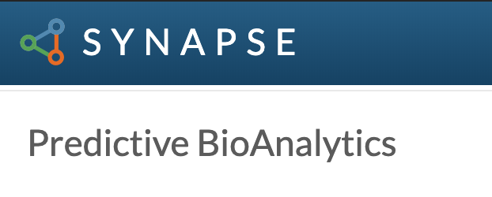
</a>

## What is Synapse?

<a href="https://www.synapse.org/#" target="blank">Synapse</a> is a data sharing platform that allows individuals and teams to share and track their data and analyses in Projects. Synapse allows researchers to control who has access to each Project's data. For this reason, Synapse requires you to have a user account.

## How do I access and download data?

The one-time set-up steps required for accessing data are:

<ol start="1">
  <li> <a href="#1-register-for-a-synapse-account">Register for a Synapse account</a></li>
  <li> <a href="#2-request-access-to-the-predictive-bioanalytics-group">Request access to the Predictive BioAnalytics Group</a></li>
</ol>

After the above steps have been completed, you can sign in and download the data at any time from the <a href="https://www.synapse.org/#!Profile:3395740/projects" target="blank">project page here</a> (&larr; bookmark me).

Detailed instructions for accessing the data:

<ol start="3">
  <li> <a href="#3-viewing-downloading-and-editing-data-files">View and download data files</a></li>
</ol>

---

### 1. Register for a Synapse account

<a href="https://www.synapse.org/#!RegisterAccount:0" target="blank">Click here to register for a new account</a> (opens in a new tab)

Enter your email address and click the green **Send registration info** button.

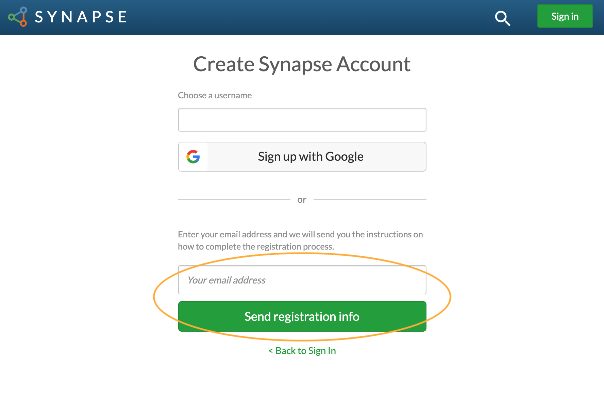

You will receive an email from Synapse with a registration link. Click the link in the email and enter your profile details.

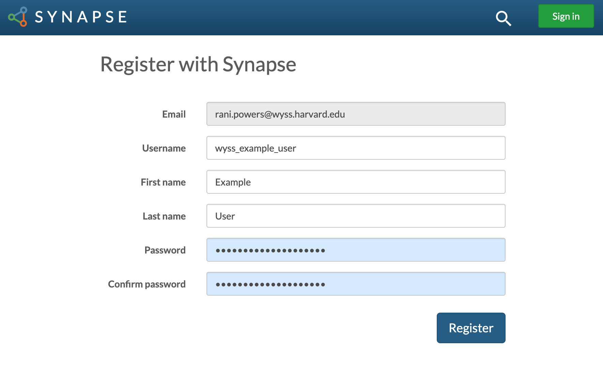

Your account has been created. Next, join the lab group to gain access to the data.

---

### 2. Request access to the Predictive BioAnalytics Group

In the upper right, click on your profile icon and select **Teams** from the dropdown menu.

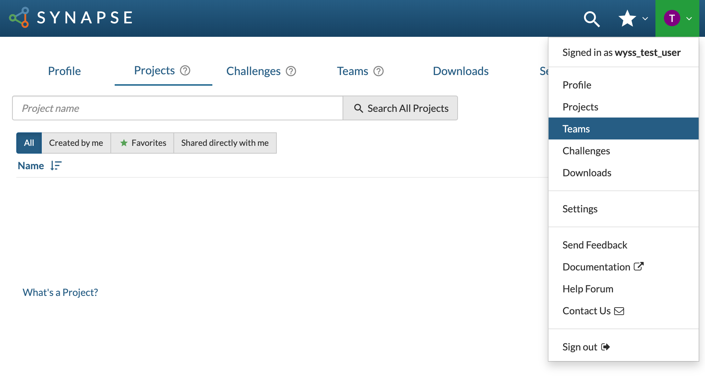

Search for "Predictive BioAnalytics" and click on the team name.

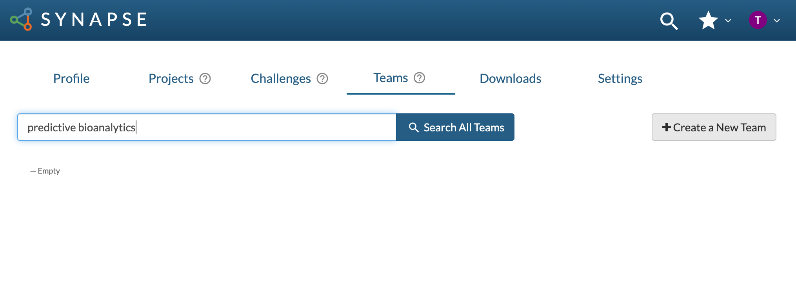

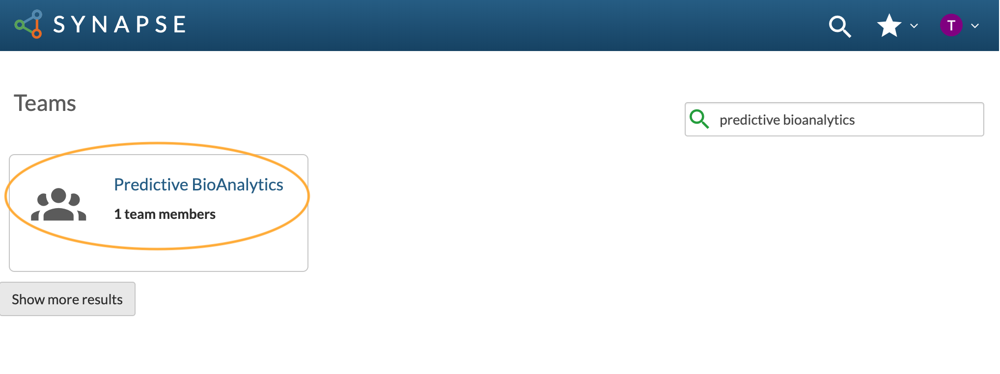

Click **Request to Join Team**.

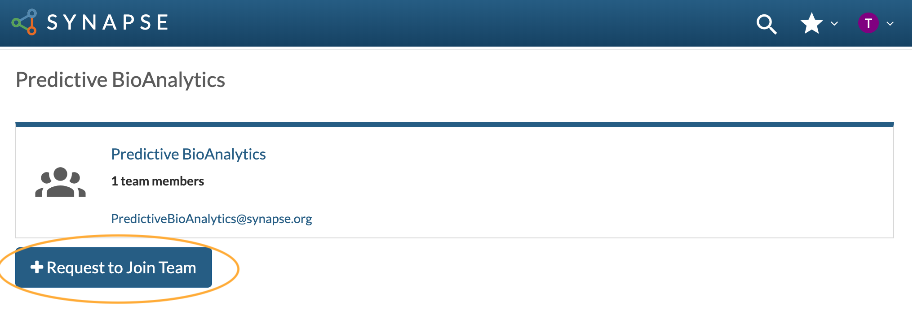

You will receive an email notifying you that you have been granted access to the team's project page and accompanying data.

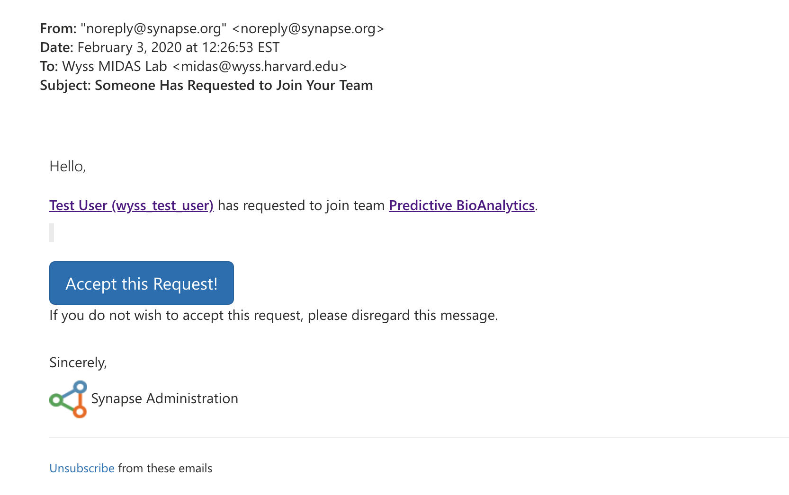

Your account now has access to view and edit data.

---

### 3. Viewing, downloading, and editing data files

As a member of the Predictive BioAnalytics Group, you can access lab projects on the **Projects** tab of your dashboard.

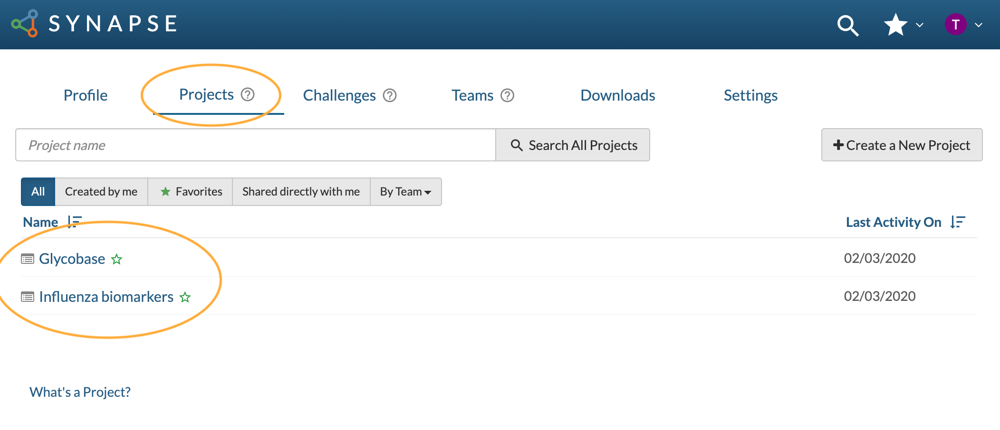

Click on the project name to view the wiki, which has a description of the data files relevant to the project. The files themselves can be downloaded from the **Files** tab. Use the download icon on the right to add one or more files to your Download List.

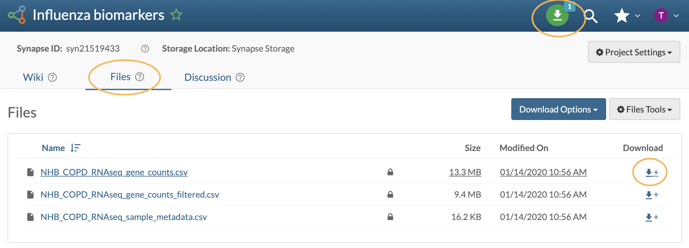

After adding the desired file(s) to your Download List, click the green Download List icon in the upper right. Synapse packages files into a zip file for download. Enter a name for the zip file and click **Create Package**.

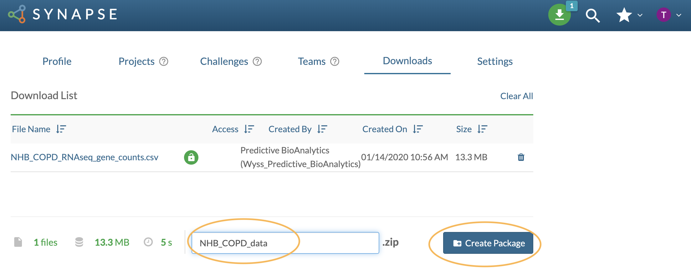

Click **Download Package** to download the zipped folder with data files to your computer.

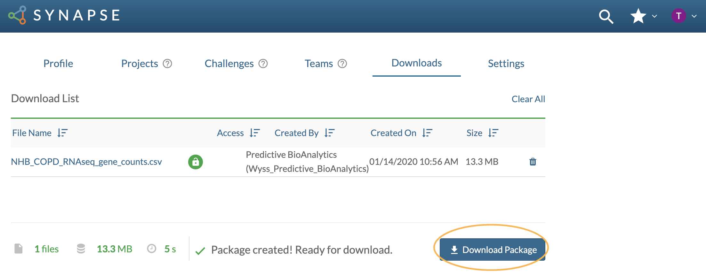

To update a file, click on the file name, click the **File Tools** button in the upper right, and select **Upload New Version of File**.

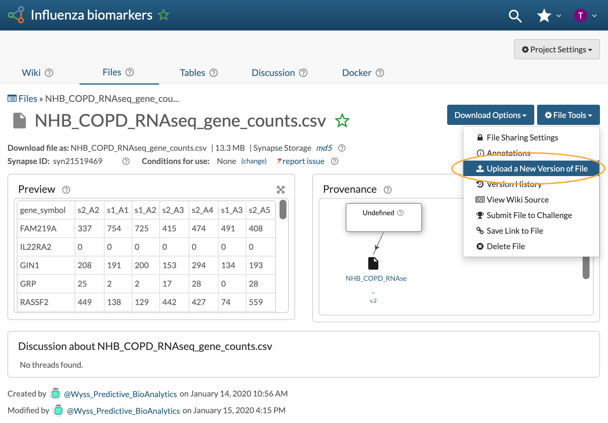

---

## Additional resources

For specific questions regarding the Predictive BioAnalytics Group on Synapse, or the data itself, please <a href="mailto:rani.powers@wyss.harvard.edu">contact Rani Powers</a>.

For general questions regarding Synapse, please refer to the full user guide <a href="https://docs.synapse.org/articles/" target="blank">here</a>.
